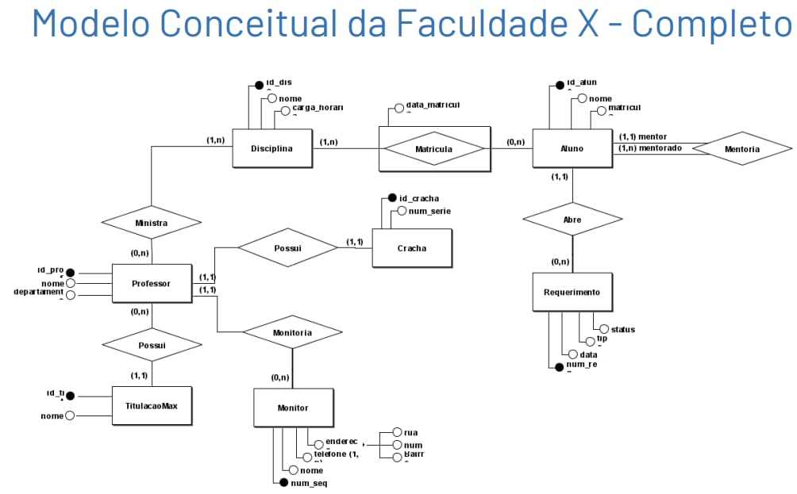

# banco-de-dados-faculdade

Modelo Conceitual da Faculdade X

Este diagrama representa o modelo conceitual (Entidade-Relacionamento) do sistema acadêmico da Faculdade X. Ele contempla as entidades Professor, Disciplina, Aluno, Cracha, TitulacaoMax, Monitor, Telefone e Requerimento, além dos relacionamentos entre elas:

Ministra (N:N) — um professor pode ministrar várias disciplinas, e uma disciplina pode ser ministrada por vários professores.
Matricula (N:N) — um aluno pode se matricular em várias disciplinas, e uma disciplina pode ter vários alunos matriculados.
Possui (1:1) — cada professor possui exatamente um crachá.
Possui (1:N) — cada professor possui uma titulação máxima.
Monitoria (1:N) — um professor pode orientar vários monitores.
Abre (1:N) — um aluno pode abrir vários requerimentos.
Mentoria (autorrelacionamento 1:N) — um aluno pode ser mentor de vários outros alunos.

A partir desse modelo conceitual, foi feito o mapeamento para o modelo relacional, resultando em 10 tabelas no banco de dados.

# modelo relacional

